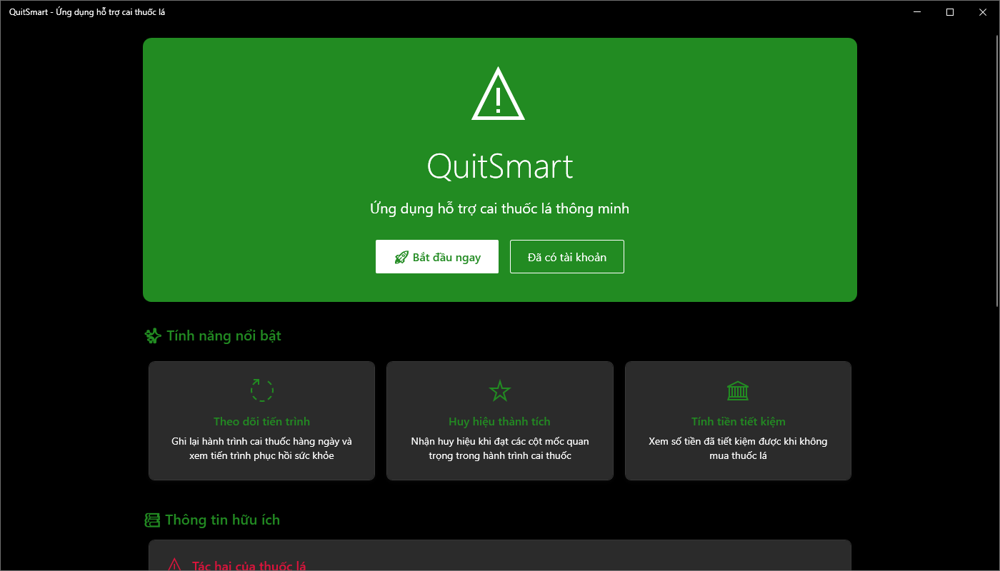
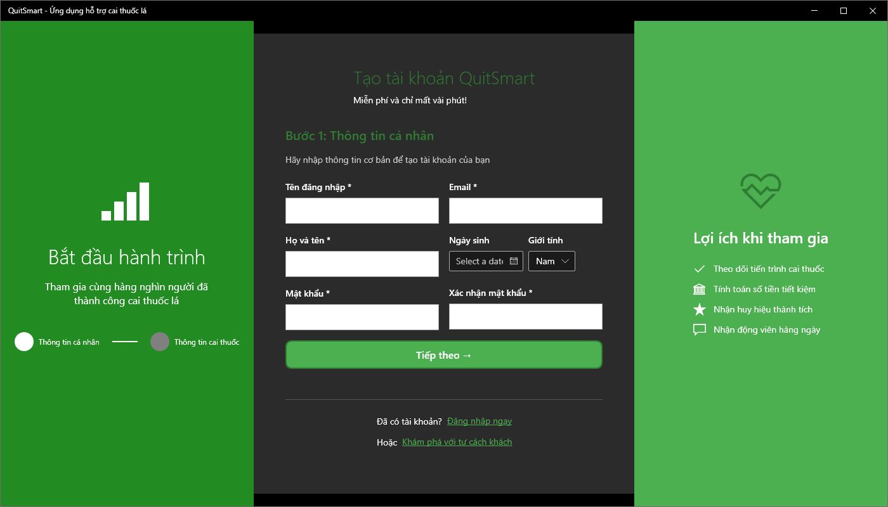
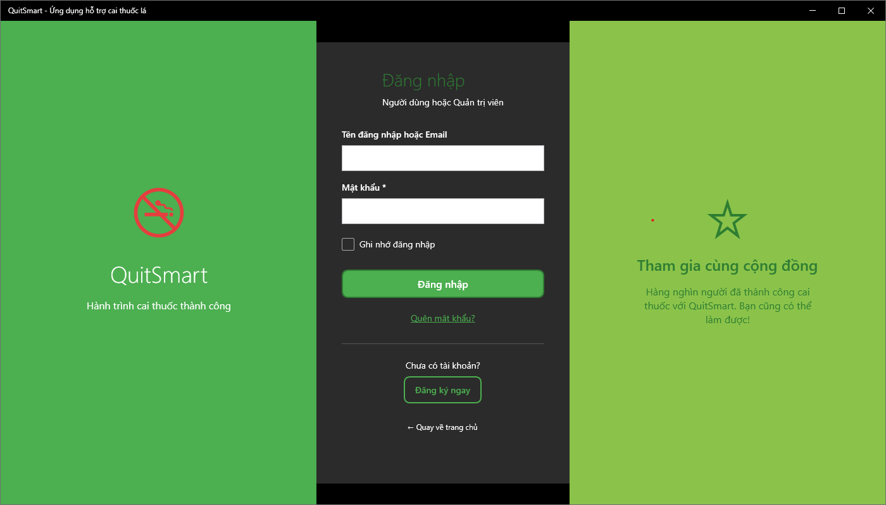
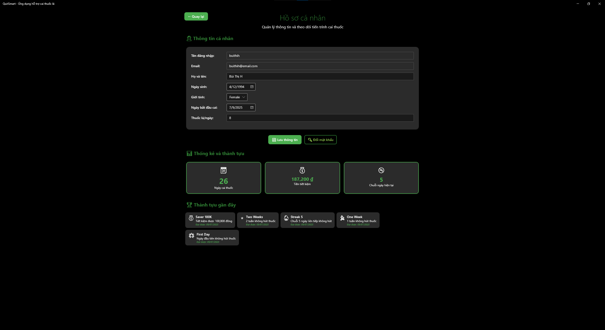
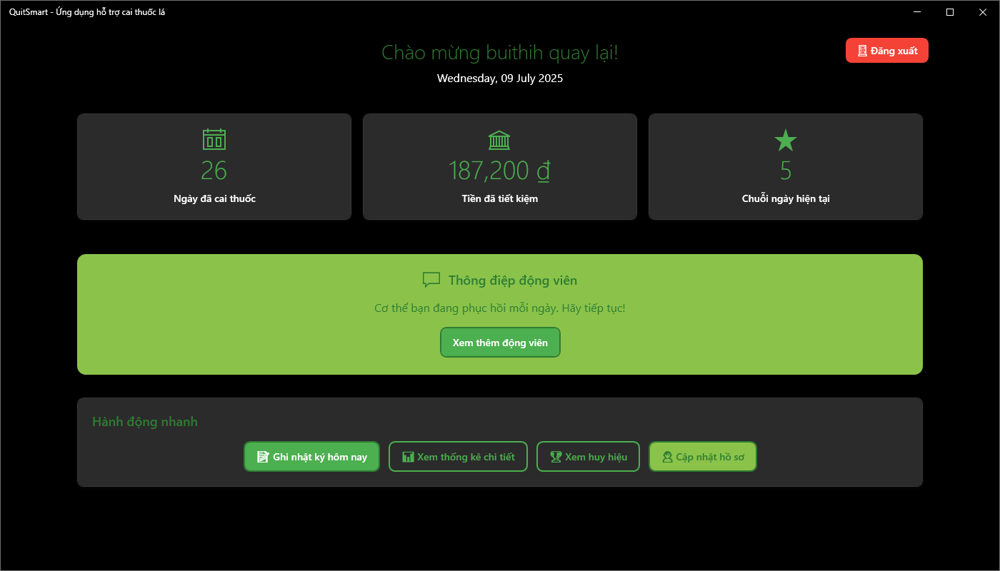
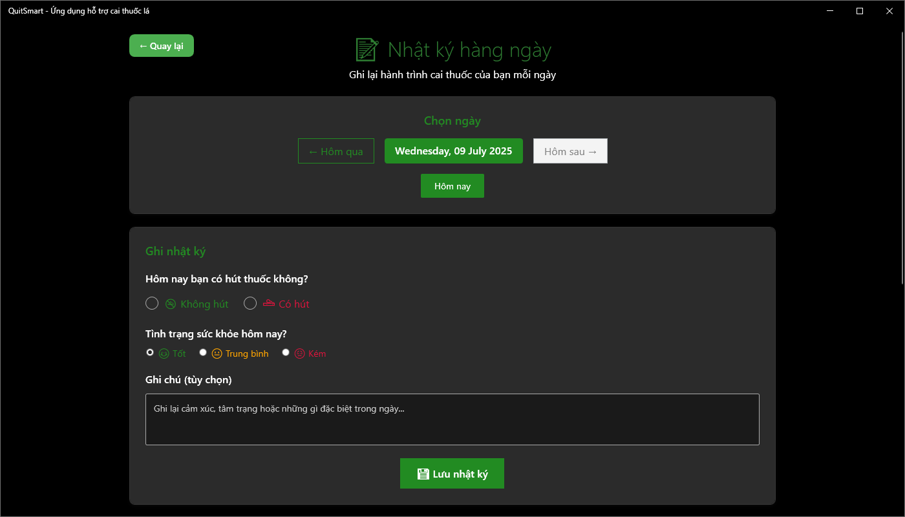
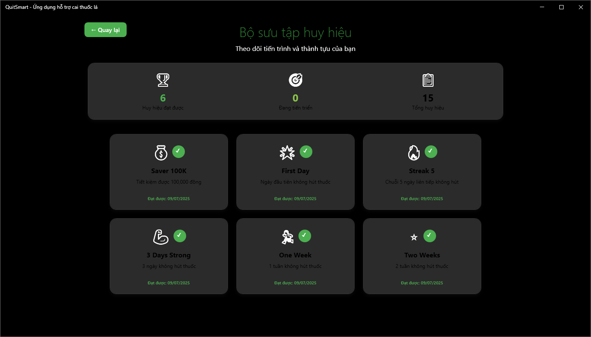
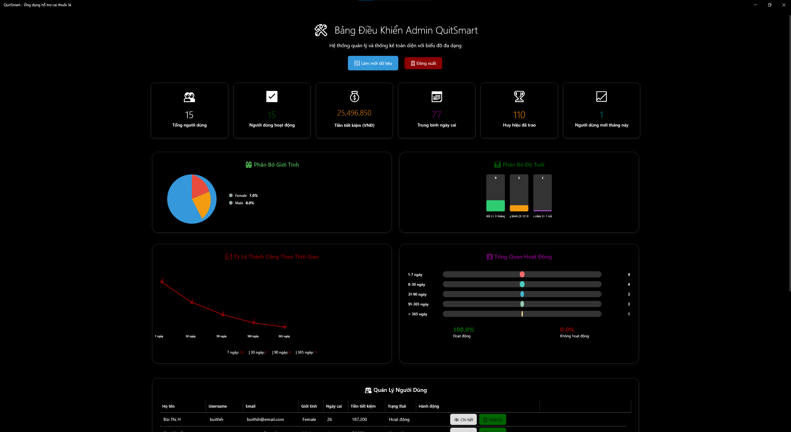

# QuitSmart - Smoking Cessation Support Application

## Overview
QuitSmart is a desktop application developed using WPF (.NET 8.0) designed to support users in their smoking cessation journey. The application provides progress tracking features, detailed statistics, motivational badge system, and useful health information.

## Key Features

### 🧑‍💼 User Management
- Account registration and login
- Personal profile management
- Password change
- Quit smoking information setup (start date, cigarettes per day, cigarette price, etc.)

### 📊 Daily Tracking
- Daily smoking status recording
- Health condition assessment
- Personal notes
- Smoke-free day streak tracking

### 🏆 Badge System
- Badges based on quit days (1 day, 1 week, 1 month, 3 months, 6 months, 1 year)
- Consecutive day streak badges
- Money saved badges (100K, 500K, 1M, 5M VND)
- Notifications when achieving new badges

### 📈 Statistics and Reports
- Total days quit smoking
- Money saved
- Longest smoke-free streak
- Current streak
- Progress tracking charts

### ℹ️ Health Information
- Information about smoking hazards
- Benefits of quitting smoking
- Expert advice
- Motivational messages

### 👨‍💼 System Administration
- Admin dashboard
- User management
- Activity logs viewing
- Health information content management
- System overview statistics

## Technologies Used

### Frontend
- **WPF (Windows Presentation Foundation)** - Main UI framework
- **ModernWpfUI** - Modern UI library for WPF
- **MVVM Pattern** - Model-View-ViewModel architecture pattern

### Backend & Database
- **.NET 8.0** - Development framework
- **Entity Framework Core** - ORM framework
- **SQL Server** - Database for production environment
- **Microsoft Extensions** - Dependency Injection and Hosting

### Other Libraries
- **MahApps.Metro** - Integration with ModernWpfUI
- **Microsoft.Extensions.DependencyInjection** - DI container
- **Microsoft.Extensions.Hosting** - Host application services

## Project Structure

```
QuitSmartApp/
├── Models/                     # Data models and Entity Framework context
│   ├── User.cs                # User model
│   ├── UserProfile.cs         # Quit smoking profile
│   ├── DailyLog.cs           # Daily log
│   ├── UserStatistic.cs      # User statistics
│   ├── BadgeDefinition.cs    # Badge definitions
│   └── QuitSmartDesktopContext.cs # Database context
├── Views/                      # XAML views
├── ViewModels/                 # ViewModels for MVVM pattern
├── Services/                   # Business logic services
├── Repositories/               # Data access layer
├── Helpers/                    # Utility classes
├── Converters/                 # Value converters for XAML
├── Configuration/              # App configuration
└── script.sql                # Database schema script
```

## Installation and Running

### System Requirements
- Windows 10/11
- .NET 8.0 Runtime
- Visual Studio 2022 (for development)

### Step 1: Clone repository
```bash
git clone [repository-url]
cd QuitSmartApp
```

### Step 2: Restore packages
```bash
dotnet restore
```

### Step 3: Update database
```bash
dotnet ef database update
```

### Step 4: Run application
```bash
dotnet run
```

Or open the solution in Visual Studio and press F5.

## Database Schema

### Main Tables
- **Users**: Basic user information
- **UserProfiles**: Quit smoking profiles (start date, cigarettes per day, etc.)
- **DailyLogs**: Daily tracking logs
- **UserStatistics**: User aggregate statistics
- **BadgeDefinitions**: Badge type definitions
- **UserBadges**: User earned badges
- **Admins**: Administrator information
- **HealthInfo**: Health information
- **MotivationalMessages**: Motivational messages

### Views
- **UserOverview**: User information overview
- **HealthTrackingOverview**: Health tracking overview
- **UserBadgeCollection**: User badge collection

## Configuration

### Connection String
Update the connection string in `AppSettings.cs` in the `Configuration` folder to connect to your database.

```csharp
// SQL Server (Production)
"Server=server_name;Database=QuitSmartDesktop;Trusted_Connection=true;"
```

### Dependency Injection
The application uses Microsoft.Extensions.DependencyInjection to manage dependencies.

## Contributing

### Contribution Process
1. Fork repository
2. Create feature branch (`git checkout -b feature/AmazingFeature`)
3. Commit changes (`git commit -m 'Add some AmazingFeature'`)
4. Push to branch (`git push origin feature/AmazingFeature`)
5. Create Pull Request

### Coding Standards
- Use C# naming conventions
- Follow MVVM pattern

## License

This project is distributed under the MIT License. See the `LICENSE` file for more information.

## Contact

- **Developer**: [Developer Name]
- **Email**: [Contact Email]
- **Website**: [Project Website]

## Acknowledgments

- ModernWpfUI team for the excellent UI library
- Microsoft for .NET and Entity Framework
- WPF developer community
- Medical experts who contributed health content

---

## Screenshots

### Guest Screen
[Guest screen screenshot]


### User Registration


### User Login


### User Profile


### User Dashboard


### Daily Tracking


### Badge Collection


### Admin Dashboard

---

**QuitSmart** - Your smoking cessation journey starts with one decision! 🚭💪